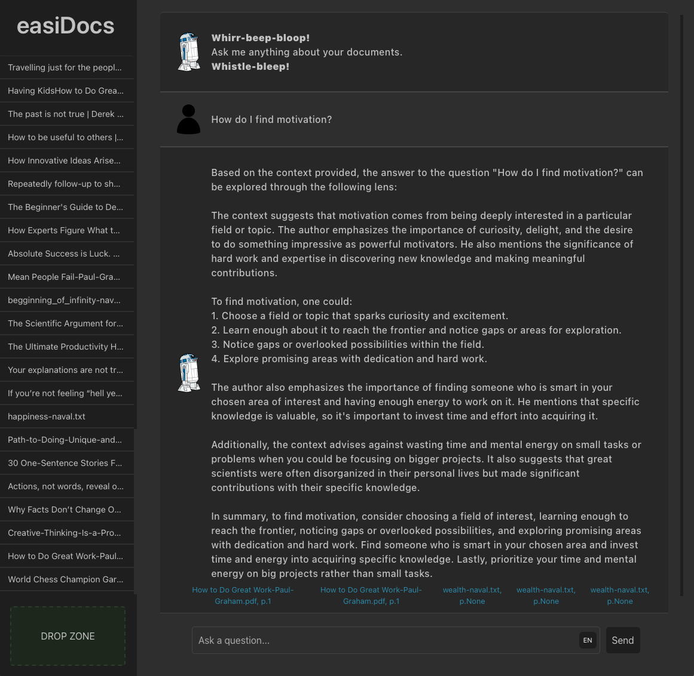
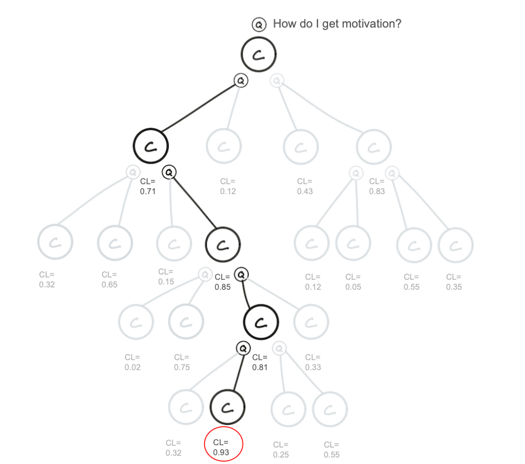
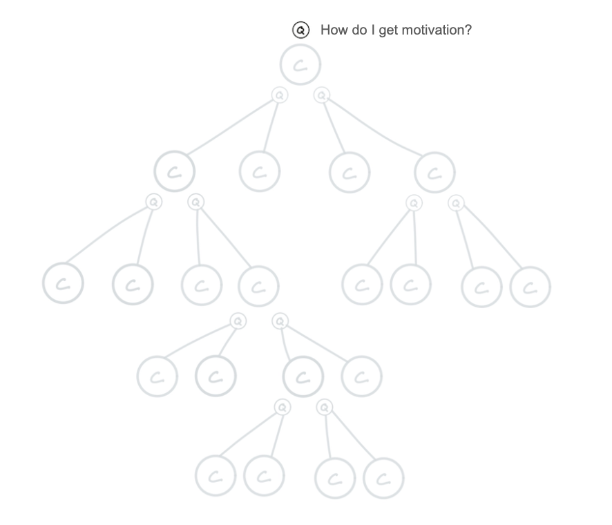
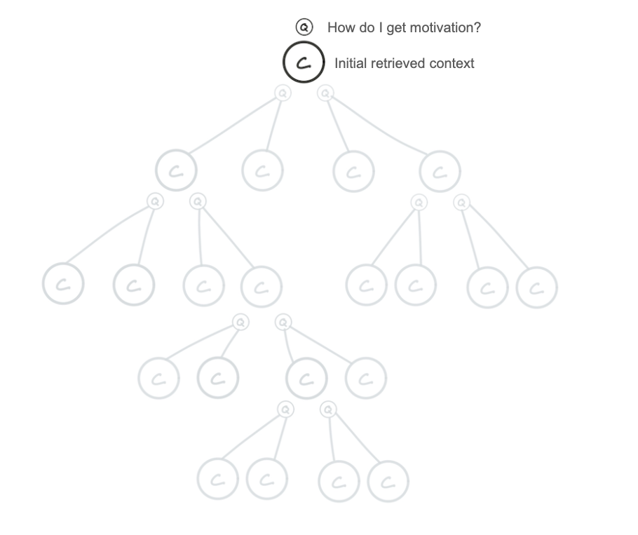
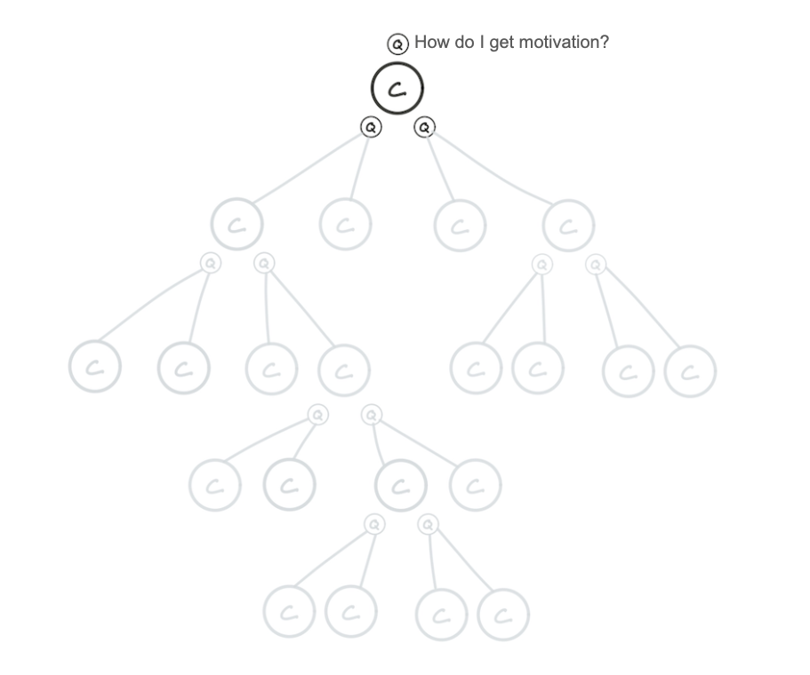
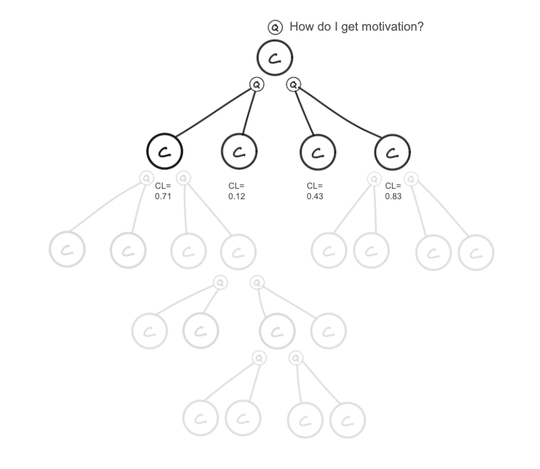
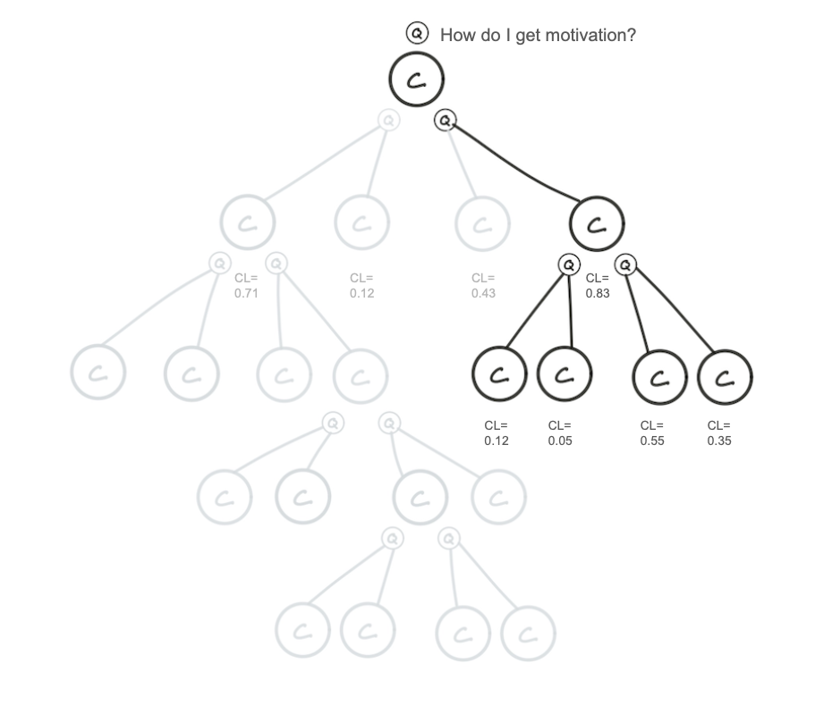
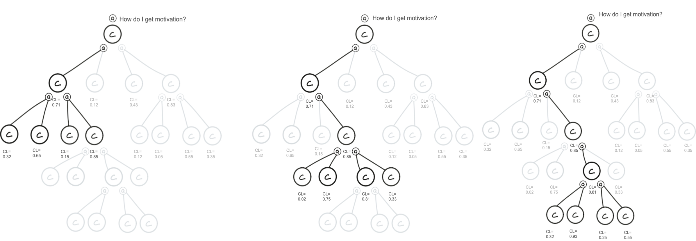
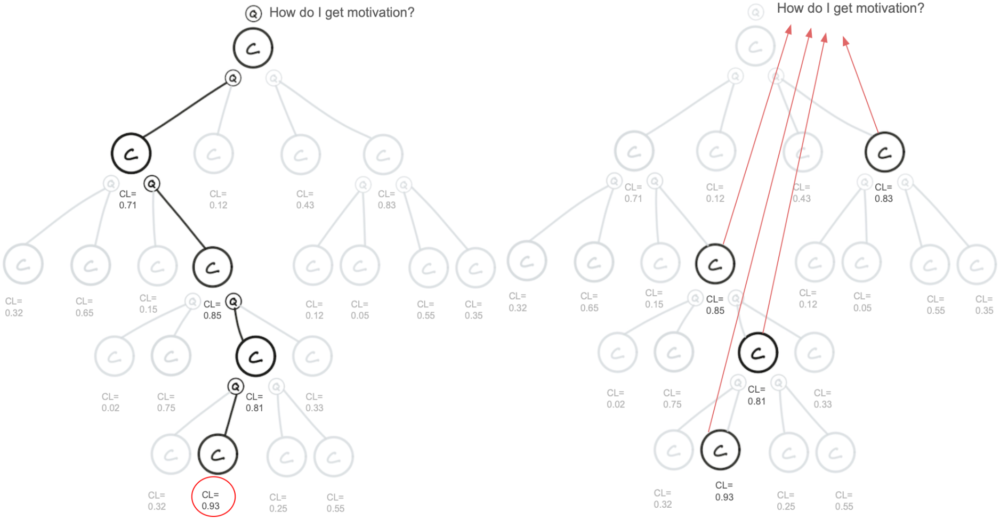

# EasiDocs

  

###### TL;DR 
##### Q*-Algorithm enhanced RAG system by using language model confidence levels to enhance information retrieval, outperforming the native system by up to 34% in challenging scenarios. It focuses on strategic path exploration and dynamic query generation, achieving a 9% average improvement, making it effective for complex queries in noisy environments.

# Project Description
This is a project to build a useful RAG-system that aims to improve the performance of the RAG system by introducing the Q*-algorithm.

# RAG (Retrieval-Augmented Generation)
Retrieval-Augmented Generation (RAG) is a technology that combines information retrieval through a semantic search and text generation. This technology enables users to "chat" with their documents, using the stored data and the context provided by the queries for the (local) LLM to generate accurate and meaningful responses. 

# Q*-Algorithm (Query Refined)

The Q*-algorithm is a refined version of the A*-algorithm, design and developed to optimize information retrieval within a Retrieval-Augmented Generation (RAG) system. This development aims to address the challenges in RAG systems, such as handling general, non-specific queries and dealing with noisy databases by focusing primarily on query semantic similarity to document embeddings. When the native RAG-system performed the worst at retrieving relevant information from queries, the Q*-algorithm enhanced RAG-system showed a 34% improvement in performance, but on average, it showed a 9% improvement in performance.

## Key Features of the Q*-algorithm

### Focus Solely on the Heuristic (h(n))
Unlike the A*-algorithm, which calculates `f(n) = g(n) + h(n)`, the Q*-algorithm exclusively focuses on the heuristic `h(n)`. This heuristic is rooted in the confidence level of the language model (LLM) to predict how likely the retrieved information will lead to the destination node, i.e., the answer to the query.

### Adaptive Heuristic
The heuristic in Q* is dynamic and reflects the context of information retrieval. It assesses the likelihood of potential information contributing to accurate and relevant output. The LLM dynamically generates new queries based on the node with the highest heuristic value, refining the search path iteratively.

### Strategic Path Exploration
Q* explores paths that the LLM evaluates as most likely to lead to the destination node. This goal-directed exploration minimizes traversal of irrelevant nodes, enhancing the search process's efficiency, especially beneficial when initially retrieved information is of low quality or irrelevant.

## Functionality within the RAG System

Within the RAG system, the Q*-algorithm uses retrieved information as context to guide the text generation process. It evaluates each piece of information based on its potential to effectively respond to the user’s query or contribute to the ongoing search. This enables the RAG system to address user queries more accurately and efficiently.

## Step-by-Step Description of Q*-Algorithm

- **Define the Goal:** Identify the search's objective, typically to find the most relevant information for a user query.

- **Retrieve Initial Context:** Retrieve an initial context from the RAG system based on the user's query, serving as the search's starting point.

- **Generate New Queries:** Generate new queries using the initial context to navigate through the database for more relevant information.

- **Evaluate Retrieved Information with Confidence Levels:** Assign confidence levels to information based on its relevance to the goal.

- **Prioritize Path Exploration:** Focus on exploring paths with nodes that have the highest confidence levels.

- **Expand Search Tree:** Add child nodes representing new contexts retrieved through additional queries.
- **Repeat the Process:** Continue reassessing and generating new queries based on paths with the highest heuristic values until the confidence level meets or exceeds a set threshold.

- **Return the Optimal Nodes:** Return nodes that meet the high confidence threshold as the most relevant to the query.

## Performance

The Q*-enhanced RAG-system showed a 9% higher score on average than the native RAG-system, indicating its efficacy in finding more relevant and higher quality information. Specifically, in the lowest-performing 25% of retrievals by the native system, the Q*-algorithm achieved scores 34% higher on average, suggesting significant improvements in cases where initially retrieved information is less relevant.

##### Embedding Model: multilingual-e5-large
##### LLM: Llama-3-8b
